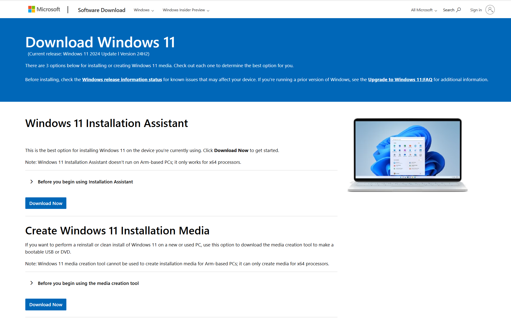
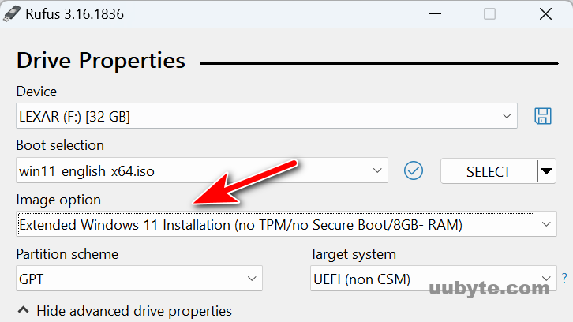

# Surface Studio 1 → Windows 11 (No TPM 2.0): Step‑by‑Step

> Install Windows 11 on the original **Surface Studio (1st Gen, 2016)** even though it lacks TPM 2.0. This repo contains a guided process, screenshots, and scripts where helpful.

> [!CAUTION]
> **Risk & Support Disclaimer**  
> These methods bypass Microsoft’s hardware checks. Machines that don’t meet Windows 11’s requirements are **unsupported**. You may miss updates, see feature upgrades blocked (especially 24H2+), or encounter bugs. Back up first and proceed at your own risk.

---

## Table of Contents
- [What you’ll need](#what-youll-need)
- [Pre‑flight checks](#pre-flight-checks)
- [Method A — In‑place upgrade from Windows 10 (keep apps/files/settings)](#method-a--in-place-upgrade-from-windows-10-keep-appsfilessettings)
- [Method B — Rufus (clean install, easiest)](#method-b--rufus-clean-install-easiest)
- [Method C — Manual registry bypass during Setup](#method-d--manual-registry-bypass-during-setup)
- [Post‑install on Surface Studio 1](#post-install-on-surface-studio-1)
- [Known caveats](#known-caveats)
- [Recovery to Windows 10](#recovery)
- [FAQ](#faq)
- [Credits & references](#credits--references)

---

> [!IMPORTANT]
> you can always reference [Windows 11 on devices that don't meet minimum system requirements](https://support.microsoft.com/en-us/windows/windows-11-on-devices-that-don-t-meet-minimum-system-requirements-0b2dc4a2-5933-4ad4-9c09-ef0a331518f1) 

## What you’ll need

- A **16 GB+ USB drive** (will be erased).
- **Windows 11 ISO** (download from Microsoft).  
  
  [https://www.microsoft.com/en-us/software-download/windows11](https://www.microsoft.com/en-us/software-download/windows11)
- One of the following tools:
  - **Rufus** (simplest path; creates a USB that skips TPM/Secure Boot/RAM checks).  
    
- **Full backup** of your Surface Studio (files + recovery).  
- (Recommended) **Surface Studio (1st Gen) Drivers & Firmware** `.msi` from Microsoft to install after Windows.  
  - [https://support.microsoft.com/en-us/surface/download-drivers-and-firmware-for-surface-09bb2e09-2a4b-cb69-0951-078a7739e120](https://support.microsoft.com/en-us/surface/download-drivers-and-firmware-for-surface-09bb2e09-2a4b-cb69-0951-078a7739e120)
  

> [!TIP]
> Keep the Surface Studio **plugged into power** during the whole process.

---

## Pre‑flight checks

1. **Firmware & BIOS**: Ensure you’re on the latest Surface firmware (from Windows Update on your existing OS).  
2. **Boot device**: Confirm you can boot from USB (**`Volume Down` + `Power`** on Surface Studio to enter boot menu).
3. **BitLocker / Encryption**: If enabled on your current Windows, **suspend or decrypt** before imaging.

---

## Method A — In‑place upgrade from Windows 10 (keep apps/files/settings)

**Why first?** This path aims to **preserve your existing applications, data, and settings** while moving to Windows 11. It’s the least disruptive approach when it works.

1. **Back up first** (image + files). In‑place upgrades are safer than clean installs but still risky on unsupported hardware.
2. Confirm you’re on **Windows 10** and fully updated.
3. Mount the **Windows 11 ISO** in Windows 10.
4. Open **Registry Editor** and go to `HKEY_LOCAL_MACHINE\SYSTEM\Setup\MoSetup`.
5. Create **DWORD (32‑bit)**: `AllowUpgradesWithUnsupportedTPMOrCPU` = **1**.
6. Run `setup.exe` from the ISO and choose **Upgrade** (not Custom). Keep personal files and apps.
7. After the upgrade, run **Windows Update** until clean.

> **If blocked** (common on 23H2/24H2 era): Microsoft may restrict feature upgrades on unsupported PCs. If your upgrade is refused or fails to apply a feature update, fall back to **Method B (Rufus)** or **Method C (Ventoy)**, or as a last resort use **Method D (manual registry)** for a clean install.

---

## Method B — Rufus (clean install, easiest)

This creates a Windows 11 installer USB that **skips TPM 2.0, Secure Boot, and RAM checks** automatically.

1. **Download the Windows 11 ISO** from Microsoft.  
2. **Download and run Rufus** (portable is fine).  
3. Insert your USB drive and select:
   - **Device**: your USB
   - **Boot selection**: the Windows 11 ISO
   - **Partition scheme**: GPT (UEFI)
4. Click **Start**. Rufus will prompt with options; **check**:
   - _Remove requirement for 4GB+ RAM, Secure Boot, and TPM 2.0_
   - (Optional) _Disable data collection_ / _Create local account_ (if present)
5. When complete, **boot the Surface Studio from USB**:
   - Shut down → hold **Volume Down** → press **Power** → release when the Surface logo appears.
6. Proceed through Windows Setup. When you reach disk selection, choose **Upgrade** to keep files or **Custom** for a clean install (clean install recommended for best stability if you already backed up).

---

## Method D — Manual registry bypass during Setup

Use this if you’re installing from a **stock** Microsoft USB/ISO without Rufus or Ventoy tweaks.

1. Boot to the Windows 11 installer. At the first screen, press **Shift+F10** to open Command Prompt.
2. Type `regedit` and press **Enter**.
3. Navigate to `HKEY_LOCAL_MACHINE\SYSTEM\Setup`.
4. **Right‑click → New → Key** and name it **`LabConfig`**.
5. Inside `LabConfig`, create **DWORD (32‑bit)** values and set **Value = 1**:
   - `BypassTPMCheck`
   - `BypassSecureBootCheck`
   - `BypassRAMCheck`
6. Close Registry Editor and the Command Prompt, then continue the installation.

---

## Post‑install on Surface Studio 1

1. **Install Surface drivers/firmware**
   - Download the latest **Surface Studio (1st Gen) Drivers & Firmware** `.msi` from Microsoft and run it.
2. **Run Windows Update** repeatedly until there are no updates left.
3. **Device Manager** → verify no unknown devices. Install any missing components from the driver pack.
4. **Optional tuning**
   - Disable features that are ineffective without TPM 2.0 (e.g., Device Encryption).  
   - Create a **local admin** and a daily driver **standard** account.

---

## Known caveats

- **Unsupported status**: Microsoft may withhold upgrades on unsupported hardware. Feature updates like **23H2/24H2** can refuse to install without additional workarounds.  
- **Security posture**: Without TPM 2.0 and guaranteed Secure Boot, features like Credential Guard / HVCI and some Windows Hello protections may be degraded or unavailable.
- **Future breakage**: Setup workarounds can change; keep a Windows 10 recovery path handy.

---

## Recovery

In case you need to recovery back to Windows 10, you can use the built in Recovery or Rollback -- but worst case pull down the Recovery Images from Microsoft at [https://support.microsoft.com/en-us/surface-recovery-image](https://support.microsoft.com/en-us/surface-recovery-image)

>NOTE: you do need the Serial Number and a Microsoft Account to access.

---

## FAQ

**Q: Can I re‑enable Secure Boot later?**  
A: You can, but it may not affect the already installed OS checks. Secure Boot is still recommended if your firmware supports it.

**Q: Will Windows Update work?**  
A: Monthly updates often apply; **feature upgrades** may be blocked and require repeating the bypass.

**Q: Can I dual‑boot?**  
A: Yes—use a separate partition/disk. The Studio 1’s storage can be upgraded, but that’s beyond this guide.

---

## Credits & references

- [Microsoft — *Ways to install Windows 11*](https://support.microsoft.com/en-us/windows/ways-to-install-windows-11-e0edbbfb-cfc5-4011-868b-2ce77ac7c70e)
- [Windows 11 on devices that don't meet minimum system requirements](https://support.microsoft.com/en-us/windows/windows-11-on-devices-that-don-t-meet-minimum-system-requirements-0b2dc4a2-5933-4ad4-9c09-ef0a331518f1)
- [Microsoft Q&A — MoSetup `AllowUpgradesWithUnsupportedTPMOrCPU` registry key](https://learn.microsoft.com/en-us/answers/questions/1083269/instruction-on-win11-upgrade-website-fails-to-offe) 
- [Windows Central — Upgrading unsupported PCs to Windows 11](https://www.windowscentral.com/how-upgrade-unsupported-computer-windows-11)
- [Surface Studio (1st Gen) Drivers & Firmware (Microsoft Download)](https://www.microsoft.com/en-us/download/details.aspx?id=54311&msockid=102d8428a6f06cc80d48978ca2f06a3e)

---

